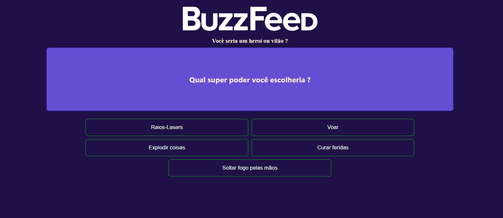

# README

## Clone do BuzzFeed em Angular

Este é um projeto simples desenvolvido em Angular que consiste em um clone do popular site BuzzFeed. Utiliza diretivas, componentes e data binding para exibir perguntas, respostas e resultados, dinamicamente aos usuários.

## Funcionalidades Principais

- **Perguntas Dinâmicas**: As perguntas são carregadas dinamicamente a partir de um arquivo JSON.
- **Respostas Interativas**: Os usuários podem selecionar entre várias opções de resposta para cada pergunta.
- **Feedback de Resultado**: Com base nas respostas do usuário, um resultado é gerado e exibido.

## Tecnologias Utilizadas

- **Angular**: Framework JavaScript para construção de interfaces de usuário.
- **HTML/CSS**: Linguagens padrão para marcação e estilização de páginas web.
- **TypeScript**: Superset do JavaScript que adiciona tipagem estática e outros recursos à linguagem.
- **JSON**: Formato leve de troca de dados utilizado para armazenar perguntas, respostas e resultados.

## Como Executar o Projeto

1. Clone este repositório para sua máquina local.
2. Certifique-se de ter o Node.js e o Angular CLI instalados.
3. Navegue até o diretório do projeto e execute `npm install` para instalar as dependências.
4. Execute `ng serve` para iniciar o servidor de desenvolvimento.
5. Abra seu navegador e acesse `http://localhost:4200` para visualizar o projeto.

## Estrutura do Projeto

- **src/app/components**: Contém os componentes Angular utilizados para exibir perguntas e respostas.
- **src/assets/data**: Armazena arquivos JSON contendo as perguntas, respostas e resultados.

---

**Nota:** Este é um projeto de exemplo e não tem afiliação com o BuzzFeed.

